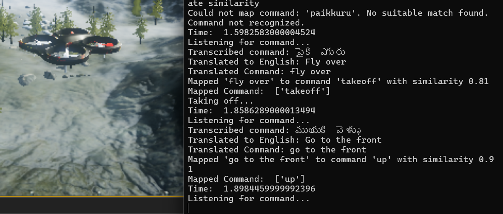
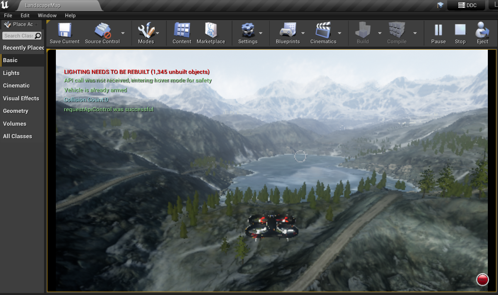
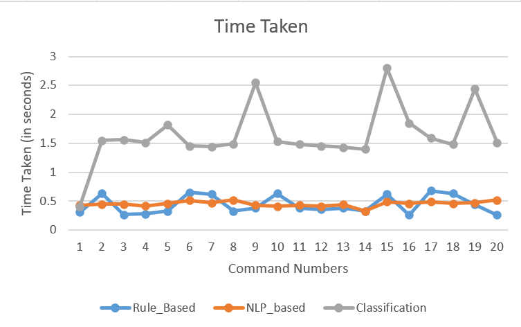

# MultiLingualVoiceControlDrone

This repository contains the implementation of a multi-lingual voice-controlled drone system built using **Microsoft AirSim**, **Unreal Engine**, and **Python**. The project demonstrates three different approaches to drone control: **Rule-based**, **NLP-based**, and **Zero-shot classification**. It supports a wide range of Indian languages for voice commands, making drone technology more accessible to diverse communities.

---

## Table of Contents

- [Introduction](#introduction)
- [Features](#features)
- [Approaches](#approaches)
  - [Rule-based Control](#rule-based-control)
  - [NLP-based Control](#nlp-based-control)
  - [Zero-shot Classification Control](#zero-shot-classification-control)
- [Setup Instructions](#setup-instructions)
- [Screenshots](#screenshots)
- [Demo Videos](#demo-videos)
- [Software and Libraries Used](#software-and-libraries-used)
- [Supported Languages](#supported-languages)
- [System Specifications](#system-specifications)
- [Contributing](#contributing)
- [License](#license)

---

## Introduction

This project aims to simplify drone control by enabling multi-lingual voice commands. By leveraging **Python Automatic Speech Recognition (ASR)**(which uses Google Web Speech API as one of its backends for automatic speech recognition (ASR) ) and advanced natural language processing techniques, the drone interprets and executes voice commands in various Indian languages.

This innovation targets users like farmers, disaster managers, and local communities, empowering them with an intuitive and accessible way to control drones.

---

## Features

- **Multi-lingual Voice Support:** Commands can be given in many Indian languages supported by Google Speech API.
- **Three Control Mechanisms:**
  - Rule-based for predefined mappings.
  - NLP-based for contextual understanding.
  - Zero-shot classification for dynamic command recognition.
- **Simulation:** The project is developed and tested in a simulated environment using Microsoft AirSim in Unreal Engine.

---

## Approaches

### Rule-based Control

- **File:** `hello_drone_ruleBased.py`
- Matches commands to predefined synonyms mapped to drone actions.
- Example: "Fly up", "Ascend", and "Go higher" are all mapped to the same action.
- Simple and effective for predictable, well-defined command sets.

### NLP-based Control

- **File:** `hello_drone_nlp.py`
- Utilizes **SpaCy** for natural language processing.
- Parses and interprets commands with semantic understanding.
- Enables more flexible interactions than rule-based approaches.

### Zero-shot Classification Control

- **File:** `hello_drone_zero.py`
- Uses **Facebook's Zero-shot Classification Model** (`facebook/bart-large-mnli`).
- Dynamically classifies commands without requiring prior training for specific phrases.
- Highly adaptable for unexpected or novel command sets.

---

## Setup Instructions

### 1. Install Required Software

- [Microsoft AirSim](https://github.com/Microsoft/AirSim)
- Unreal Engine 4.27
- [Anaconda](https://www.anaconda.com/)
- Visual Studio (not Visual Studio Code)

### 2. Clone the AirSim Repository

```bash
git clone https://github.com/Microsoft/AirSim.git
```

### 3. Set Up Unreal Engine Environment

Follow the instructions on the [AirSim Build Documentation](https://microsoft.github.io/AirSim/build_windows/).

### 4. Install Python Dependencies

Create a Python environment using Anaconda and install the required libraries:

```bash
conda create -n airsim_env python=3.8
conda activate airsim_env
pip install spacy transformers SpeechRecognition
```

### 5. Set Up AirSim Simulation

- Use the `Landscape Mountains` project for the 3D simulation environment.
- Ensure proper connection between Unreal Engine and AirSim using Visual Studio.

### 6. Run the Code

Locate the project in Unreal Projects folder . Open Landscape.soln ( Visual Studio file ) .Press F5 (This starts Unreal Engine along with AirSim).
Now, just press Play button and the drone seems to spwan at the Player Start point .
Open Anaconda Prompt , Activate the created environment(here airsim_env) .
Navigate to `AirSim/PythonClient/multirotor` , paste the given python codes instead of hello_drone.py (sample code given my Airsim) and execute one of the control scripts.

### 6. Run the Code

Follow these steps to run the drone control scripts:

**a. Launch Unreal Engine with AirSim**:

- Locate the project in the Unreal Projects folder
- Open `Landscape.sln` in Visual Studio
- Press `F5` to start Unreal Engine with AirSim
- Press the Play button to spawn the drone at the Player Start point

**b. Prepare Python Environment**:

- Open Anaconda Prompt
- Activate the created environment:
  ```bash
  conda activate airsim_env
  ```

**c. Navigate and Execute Control Scripts**:

- Navigate to the project directory:
  ```bash
  cd AirSim/PythonClient/multirotor
  ```
- Replace the default `hello_drone.py` with one of the provided control scripts:

```bash
python hello_drone_ruleBased.py
python hello_drone_nlp.py
python hello_drone_zero.py
```

---

## Screenshots







## Demo Videos

Watch the drone in action in our demo videos:

- [Demo Video 1: Rule-based Control using Telugu](https://youtu.be/AyiS42ulePM)
- [Demo Video 2: Hindi language](https://youtu.be/lx2o9z6CASI)
- [Demo Video 3: NLP processing, English](https://youtu.be/YDHSt__P_g0)

---

## Software and Libraries Used

### Software

- Microsoft AirSim
- Unreal Engine 4.27
- Anaconda
- Visual Studio (NOT Visual Studio Code)

### Libraries

- AirSim Python API
- SpaCy
- SpeechRecognition (Google Speech Recognition API)
- Transformers (`facebook/bart-large-mnli`)

---

## Supported Languages

The project supports voice commands in many Indian languages. Here are the language codes :

- Hindi (`hi`)
- Bengali (`bn`)
- Telugu (`te`)
- Marathi (`mr`)
- Tamil (`ta`)
- Gujarati (`gu`)
- Kannada (`kn`)
- Malayalam (`ml`)
- Odia (`or`)
- Punjabi (`pa`)
- Assamese (`as`)
- Urdu (`ur`)

---

## System Specifications

- **Operating System:** Windows 11
- **Laptop:** HP Victus
- **Processor:** Intel Core i7 (12th Gen)
- **GPU:** NVIDIA RTX 3050
- **RAM:** 16 GB

---

## Contributing

Contributions are welcome! Please fork this repository and submit a pull request with your changes.

---

## License

This project is licensed under the MIT License. See the [LICENSE](LICENSE) file for details.

---

Feel free to reach out if you have any questions or suggestions. Happy flying!
